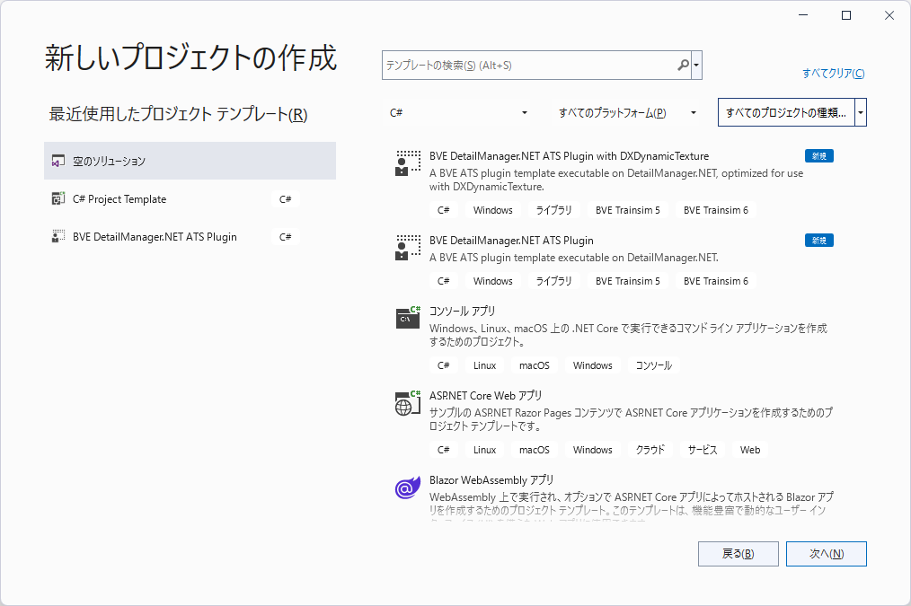

# リリース詳説
DetailManager.NET本体のコード、構成については[リポジトリ詳説](Repository.md)をご覧ください。

## フォルダ構成

```
├ _DummyTrain
│
├ PluginTemplatePack
│ ├ DetailManagerNET.PluginTemplatePack.vsix
│ └ …
│
├ SamplePlugins
│ ├ Alert
│ ├ DynamicTexture
│ └ SimpleAts
│
└ Readme.md
```

### Plugins/_DummyTrain

サンプルプラグインの動作を簡単に試せるダミー車両です。ダウンロードしたら、まずは`Plugins/_DummyTrain/Vehicle.txt`を絶対パスで適当なシナリオへ指定して、動作を確認してみてください。

#### 初期状態での機能

- SamplePlugin.Alert - シナリオを開始した時（Initializeメソッド呼出時）、シナリオ開始から10秒経過した時にダイアログを表示します。
- SamplePlugin.DynamicTexture - [DXDynamicTexture](https://github.com/zbx1425/DXDynamicTexture)のサンプルです。`Plugins/_DummyTrain/Panel/Raindow.tex.png`を置き換え、ランダムな色の背景に「SamplePlugin.DynamicTexture」の白い文字を描画します。
- SamplePlugin.SimpleAts - 100km/hを超過すると95km/hまで常用最大ブレーキで減速します。作動中はATS0の音を鳴らし、ATS255のパネルを表示します。

#### 注意

- **ダミー車両のみを別フォルダに移動しないでください。サンプルプラグインのビルド時、出力されたDLLを`Plugins/_DummyTrain/Ats`へ自動配置しています。** 詳細は各サンプルプラグインプロジェクトの[プロパティ]→[ビルド イベント]をご確認ください。

### Plugins/Libraries

#### リリースの場合

ライブラリがこのフォルダ以下に格納されています。

#### コンテンツ一覧

- `Libraries/(x64 or x86)/DetailManagerNET.dll` - DetailManager.NETのメインDLL。読み込みたいDLLと同じフォルダにコピーしてください（プラグインテンプレートを使用する場合は自動でコピーされます）。なお、プラグインからこのDLLを参照する必要はありません。
- `Libraries/DetailManagerNET.PluginHost.dll` - プラグインに公開するクラス・構造体や、プラグインの基底となるインターフェースを提供するプラグインホストDLL。読み込みたいDLLと同じフォルダにコピーしてください（プラグインテンプレートを使用する場合は自動でコピーされます）。また、プラグイン開発時はこのDLLを参照に追加してください。

#### 注意

- **このフォルダやフォルダ内のコンテンツを削除・移動しないでください。サンプルプラグインのビルド時、このフォルダ内のDLLを自動でコピーしています。** 詳細は各サンプルプラグインプロジェクトの[プロパティ]→[ビルド イベント]をご確認ください。
- サンプルプラグインはこれらのDLLを自動でコピー・改名するため、特別な作業は必要ありません。

### Plugins/PluginTemplates

プラグインのテンプレートがこのフォルダ内に格納されています。

以下のテンプレートをそのままビルドすると、「何もしないATSプラグイン」として動作します。  
また、各プロジェクトはビルド後に`Plugins/_DummyTrain/Ats`へ自動配置するように設定されています。詳細は各テンプレートの[プロパティ]→[ビルド イベント]をご確認ください。

#### Plugins/PluginTemplates/Basic

最もベーシックなテンプレートです。必要最低限なコードのみが記述されています。

#### Plugins/PluginTemplates/DynamicTexture

[DXDynamicTexture](https://github.com/zbx1425/DXDynamicTexture)を使用するプラグインのテンプレートです。Basicと同一のコードの他、DXDynamicTextureの動作に必要なコード、テクスチャを編集しやすくするためのクラス（初期クラス名：`YourHN.YourPluginName.DynamicTexture`）が定義されています。また、ビルド時のターゲットプラットフォームの設定によってターゲットフレームワークが自動で変更されるようになっています。

### Plugins/SamplePlugins

プラグインのサンプルがこのフォルダ内に格納されています。

以下のサンプルは初めからダミー車両で参照するように設定されており、動作を確認することができます。  
また、各プロジェクトはビルド後に`Plugins/_DummyTrain/Ats`へ自動配置するように設定されています。詳細は各サンプルの[プロパティ]→[ビルド イベント]をご確認ください。

#### Plugins/SamplePlugins/Alert

シナリオを開始した時（Initializeメソッド呼出時）、シナリオ開始から10秒経過した時にダイアログを表示します。

#### Plugins/SamplePlugins/DynamicTexture

[DXDynamicTexture](https://github.com/zbx1425/DXDynamicTexture)のサンプルです。`Plugins/_DummyTrain/Panel/Raindow.tex.png`を置き換え、ランダムな色の背景に「SamplePlugin.DynamicTexture」の白い文字を描画します。

#### Plugins/SamplePlugins/SimpleAts

100km/hを超過すると95km/hまで常用最大ブレーキで減速します。作動中はATS0の音を鳴らし、ATS255のパネルを表示します。

## 使い方
もし何かお困りのことがあれば、お気軽にTwitterまたはメールからお問い合わせください（多忙なときは返信が遅くなる可能性があります）。お手数ですが、お問い合わせ先は[ユーザープロフィール](https://github.com/automatic9045)をご参照ください。

### 1. Visual Studioにプラグインテンプレートパックをインストールする

1. `PluginTemplatePack/DetailManagerNET.PluginTemplatePack.vsix`をダブルクリックします。インストーラーが起動します。

   

2. 少し待つと以下のような画面が表示されます。インストール先のVisual Studioのバージョンを選択して「Install」をクリックします。

   

3. 以下のように「Waiting on the following processes to shut down before continuing with modifications」（＝インストールを開始するため、以下のプロセスの終了を待機しています）と表示された場合は、現在開いているVisual Studioのウィンドウを閉じます。

   

4. インストールが開始されます。少々お待ちください。

   

5. 以下の画面が表示されたらインストールは完了ですが、インストールしたパッケージを有効化する必要があります。「Close」をクリックして次に進みます。

   

### 2. プラグインテンプレートパックを有効化する

1. Visual Studioを起動し、「コードなしで続行」を選択します。

   

2. [拡張機能(X)] → [拡張機能の管理(M)]を選択します。

3. [インストール済み] → [BVE DetailManager.NET ATS Plugin Template Pack]を選択し、「有効化」をクリックします。

   

4. **Visual Studioを終了し、再度起動します。** 「新しいプロジェクトの作成」でプラグインテンプレートが表示されていれば、プラグインテンプレートパックのインストール・有効化は成功です。

   

#### プラグインテンプレートが表示されないときは

- `PluginTemplatePack/DetailManagerNET.PluginTemplatePack.vsix`を実行しましたか？
- プラグインテンプレートパックを有効化しましたか？
- プラグインテンプレートパックを有効化した後、Visual Studioは再起動しましたか？

### 3. テンプレートからプロジェクトを作成し、コードを書く

クラスの構造はほぼ従来のATSプラグインと同じです。

### 4. デバッグする

1. ビルドする前に、`if DEBUG`～`endif`などで読込を一時停止させるコード（`System.Windows.Forms.MessageBox.Show(string)`など）を挿入しておきます。プラグインテンプレートには初めから記述されています。

2. **Debug│x64・Debug│x86どちらかの構成にて**[ビルド(B)]→[ソリューションのリビルド(R)]からプロジェクトを**リビルド**し、ビルド構成で指定したターゲットプラットフォーム（x64 / x86）に合わせたバージョンのBVEでシナリオを読み込みます。

3. **1.で挿入したコードを実行中に**（`System.Windows.Forms.MessageBox.Show(string)`を使用している場合は、ダイアログの表示中に）[デバッグ(D)]→[プロセスにアタッチ(P)...]からBveTs.exeを選択し、BVEのプロセスにアタッチします。
4. 試しに[すべて中断 (Ctrl + Alt + Break)]からプロセスを中断します。1.で挿入したコードがハイライトされていれば、デバッグが可能な状態になっています。「アプリケーションはブレーク モードになっています」などと表示される場合は正しくプロセスにアタッチできていません。
5. [続行(C)]からプロセスを再開し、デバッグを開始します。特定のコードの動作を確認したいときはブレークポイントが便利です。

### 5. プラグインをリリースする

動作には以下のファイルが必要です。pdbファイルは同梱不要です。

- 開発したDLL（`AtsP.dll`など）
  - PluginTemplate.DXDynamicTextureを使用している場合はx64版（BVE6用）、x86版（BVE5用）で分かれています。
- DetailManager.NET メインDLL（`DetailManagerNET.dll`）
  - x64版（BVE6用）、x86版（BVE5用）で分かれています。  
    プラグインテンプレートを使用している場合は`DetailManagerNET.x64.dll`、`DetailManagerNET.x86.dll`として同梱されています。
- DetailManager.NET プラグインホストDLL（`DetailManagerNET.PluginHost.dll`）

**また、使用しているライブラリのライセンスに従った表示・ファイル添付が必要です。これを忘れた場合はライセンス違反となります。**

なお、DetailManager.NET独自のコードは[本家DetailManager](https://github.com/mikangogo/DetailManager)に則って[The Unlicense](LICENSE)のもとに提供されており、**DetailManager.NET独自のコードに限っては** 著作権やライセンスを表示する必要はありません。

DetailManager.NETやサンプルプラグインが使用しているライブラリ（DllExport、DXDynamicTextureなど）のライセンスについては、[Readme.md](../Readme.md)の「使用ライブラリ」項を参照してください。
