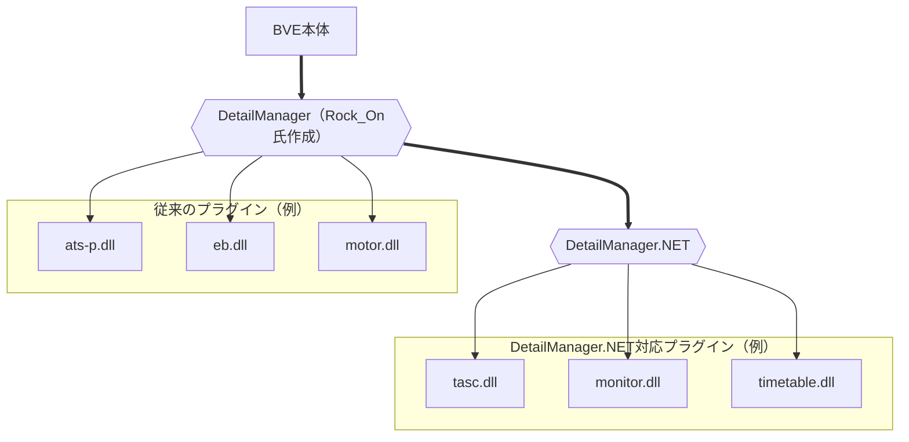

# DetailManager.NET
【BVE5・6】C#などの.NET系言語で開発したATSプラグインをDllExport無しでBVEから読み込めるようにするプラグインです。

## 具体的な機能
基本的な使い方はRock_On氏が開発された[DetailManager](https://github.com/mikangogo/DetailManager)と同様で、DetailModulesNET.txtに列挙されたATSプラグインを読み込みます。  
ただし、DetailManager.NETが読み込み可能なのは、DetailManager.NET独自の仕様に沿って実装されたATSプラグインのみです。そのため、 **従来のATSプラグインと共存させるには「DetailManagerからDetailManager.NETを読み込む」必要があります。**

一方、関数については従来のATSプラグインの仕様とほとんど変えていません。  
これは、学習コストをできる限り下げ、従来のATSプラグインのコードを容易に移植できるようにするためです。

なお、C#に最適化したフレームワークについては別プロジェクトにて公開予定です。

## 必要なもの

- Visual Studio 2022（2017、2019などでも動作する可能性はあります）
  - ドキュメントではVisual Studio 2022を使用することを前提に説明しています。
- .NET Framework 3.5
- .NET Framework 4.8

## 詳細

### リリース……プラグインの開発方法を知りたい方

[リリース詳説](Documents/Release.md)

### リポジトリ……DetailManager.NET本体のコード・構造を知りたい方

[リポジトリ詳説](Documents/Repository.md)

## ライセンス
DetailManager.NET独自のコードは[The Unlicense](LICENSE)のもとに提供されますが、以下の使用しているライブラリに関してはそれぞれのライセンスが適用されます。

## 使用ライブラリ
### [DllExport](https://github.com/3F/DllExport) (MIT)
Copyright (c) 2009-2015  Robert Giesecke  
Copyright (c) 2016-2021  Denis Kuzmin <x-3F@outlook.com> github/3F

### [DXDynamicTexture for BVE Trainsim 5/6](https://github.com/zbx1425/DXDynamicTexture) (MIT)
Copyright (c) 2021 zbx1425

DetailManager.NET本体では使用していませんが、付属のテンプレート「PluginTemplate.DynamicTexture」、サンプル「SamplePlugin.DynamicTexture」にて参照しています。

### [Harmony](https://github.com/pardeike/Harmony) (MIT)

Copyright (c) 2017 Andreas Pardeike

DetailManager.NET本体では使用していませんが、付属のテンプレート「PluginTemplate.DynamicTexture」、サンプル「SamplePlugin.DynamicTexture」にて参照しています。
