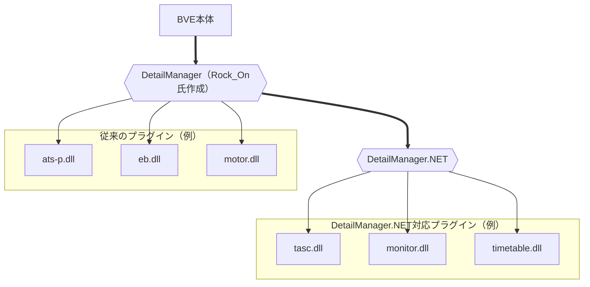

# DetailManager.NET
【BVE5・6】C#などの.NET系言語で開発したATSプラグインをDllExport無しでBVEから読み込めるようにするプラグインです。

## 具体的な機能
基本的な使い方はRock_On氏が開発された[DetailManager](https://github.com/mikangogo/DetailManager)と同様で、DetailModulesNET.txtに列挙されたATSプラグインを読み込みます。  
ただし、DetailManager.NETが読み込み可能なのは、DetailManager.NET独自の仕様に沿って実装されたATSプラグインのみです。そのため、 **従来のATSプラグインと共存させるには「DetailManagerからDetailManager.NETを読み込む」必要があります。**




一方、関数については従来のATSプラグインの仕様とほとんど変えていません。  
これは、学習コストをできる限り下げ、従来のATSプラグインのコードを容易に移植できるようにするためです。

なお、C#に最適化したフレームワークについては別プロジェクトにて公開予定です。

## 必要なもの

- Visual Studio 2022（2017、2019などでも動作する可能性はあります）
  - 以下、Visual Studio 2022を使用することを前提に説明しています。
- .NET Framework 3.5
- .NET Framework 4.8

## フォルダ構成

#### リリース

```
├ _DummyTrain
│
├ Libraries
│ ├ x64
│ │ └ DetailManagerNET.dll
│ │
│ ├ x86
│ │ └ DetailManagerNET.dll
│ │
│ └ DetailManagerNET.PluginHost.dll
│
├ PluginTemplates
│ ├ Basic
│ └ DynamicTexture
│
├ SamplePlugins
│ ├ Alert
│ ├ DynamicTexture
│ └ SimpleAts
│
└ Readme.md
```

#### リポジトリ

```
├ DetailManagerNET
├ DetailManagerNET.PluginHost
│
├ Plugins
│ ├ _DummyTrain
│ │
│ ├ Libraries
│ │ ├ x64
│ │ └ x86
│ │
│ ├ PluginTemplates
│ │ ├ Basic
│ │ └ DynamicTexture
│ │
│ └ SamplePlugins
│   ├ Alert
│   ├ DynamicTexture
│   └ SimpleAts
│
├ DetailManagerNET.sln
└ Readme.md
```

以下、ディレクトリ名はリポジトリに準拠します。リリースではディレクトリ名のはじめから`Plugins/`を抜いた形になります。

### DetailManagerNET

※リリースには含まれません

メインのプロジェクトです。  
ビルド時に`Plugins/Libraries/(x64 or x86)/DetailManagerNET.dll`へ自動配置します。

### DetailManagerNET.PluginHost

※リリースには含まれません

プラグインに公開するクラス・構造体や、プラグインの基底となるインターフェースを提供するプロジェクトです。  
ビルド時に`Plugins/Libraries/DetailManagerNET.PluginHost.dll`へ自動配置します。

**プラグイン開発時は、このプロジェクトではなく`Plugins/Libraries/DetailManagerNET.PluginHost.dll`を参照に追加してください。**

### Plugins/_DummyTrain

サンプルプラグインの動作を簡単に試せるダミー車両です。リリースをダウンロードしたら、まずは`Plugins/_DummyTrain/Vehicle.txt`を絶対パスで適当なシナリオへ指定して、動作を確認してみてください。

#### 初期状態での機能

- SamplePlugin.Alert - シナリオを開始した時（Initializeメソッド呼出時）、シナリオ開始から10秒経過した時にダイアログを表示します。
- SamplePlugin.DynamicTexture - [DXDynamicTexture](https://github.com/zbx1425/DXDynamicTexture)のサンプルです。`Plugins/_DummyTrain/Panel/Raindow.tex.png`を置き換え、ランダムな色の背景に「SamplePlugin.DynamicTexture」の白い文字を描画します。
- SamplePlugin.SimpleAts - 100km/hを超過すると95km/hまで常用最大ブレーキで減速します。作動中はATS0の音を鳴らし、ATS255のパネルを表示します。

#### 注意

- **ダミー車両のみを別フォルダに移動しないでください。プラグインテンプレート・サンプルプラグインのビルド時、出力されたDLLを`Plugins/_DummyTrain/Ats`へ自動配置しています。** 詳細は各プラグインテンプレート・サンプルプラグインプロジェクトの[プロパティ]→[ビルド イベント]をご確認ください。
- **リポジトリをクローンまたはダウンロードした場合、初期状態ではATSプラグインが配置されていません。** 2回ほどリビルドすると、ATSプラグインが`Plugins/_DummyTrain/Ats`へ自動で配置されます。

### Plugins/Libraries

#### リポジトリの場合

DetailManagerNET、DetailManagerNET.PluginHostのビルドがこのフォルダ以下に自動で配置されます。  
出力先は以下の通りです。

- DetailManagerNET- `Plugins/Libraries/(x64 or x86)/DetailManagerNET.dll`
- DetailManagerNET.PluginHost - `Plugins/Libraries/DetailManagerNET.PluginHost.dll`

**※初期状態では配置されていません。一度リビルドしてください。**

#### リリースの場合

ライブラリがこのフォルダ以下に格納されています。

#### コンテンツ一覧

- `Libraries/(x64 or x86)/DetailManagerNET.dll` - DetailManager.NETのメインDLL。読み込みたいDLLと同じフォルダにコピーしてください。なお、プラグインからこのDLLを参照する必要はありません（循環参照になります）。
- `Libraries/DetailManagerNET.PluginHost.dll` - プラグインに公開するクラス・構造体や、プラグインの基底となるインターフェースを提供するプラグインホストDLL。読み込みたいDLLと同じフォルダにコピーしてください。また、プラグイン開発時はこのDLLを参照に追加してください。

#### 注意

- **このフォルダやフォルダ内のコンテンツを削除・移動しないでください。プラグインテンプレート・サンプルプラグインのビルド時、このフォルダ内のDLLを自動でコピーしています。** 詳細は各プラグインテンプレート・サンプルプラグインプロジェクトの[プロパティ]→[ビルド イベント]をご確認ください。
- プラグインテンプレート、サンプルプラグインはこれらのDLLを自動でコピー・改名するため、特別な作業は必要ありません。

### Plugins/PluginTemplates

プラグインのテンプレートがこのフォルダ内に格納されています。

以下のテンプレートをそのままビルドすると、「何もしないATSプラグイン」として動作します。  
また、各プロジェクトはビルド後に`Plugins/_DummyTrain/Ats`へ自動配置するように設定されています。詳細は各テンプレートの[プロパティ]→[ビルド イベント]をご確認ください。

#### Plugins/PluginTemplates/Basic

最もベーシックなテンプレートです。必要最低限なコードのみが記述されています。

#### Plugins/PluginTemplates/DynamicTexture

[DXDynamicTexture](https://github.com/zbx1425/DXDynamicTexture)を使用するプラグインのテンプレートです。Basicと同一のコードの他、DXDynamicTextureの動作に必要なコード、テクスチャを編集しやすくするためのクラス（初期クラス名：`YourHN.YourPluginName.DynamicTexture`）が定義されています。また、ビルド時のターゲットプラットフォームの設定によってターゲットフレームワークが自動で変更されるようになっています。

### Plugins/SamplePlugins

プラグインのサンプルがこのフォルダ内に格納されています。

以下のサンプルは初めからダミー車両で参照するように設定されており、動作を確認することができます。  
また、各プロジェクトはビルド後に`Plugins/_DummyTrain/Ats`へ自動配置するように設定されています。詳細は各サンプルの[プロパティ]→[ビルド イベント]をご確認ください。

#### Plugins/SamplePlugins/Alert

シナリオを開始した時（Initializeメソッド呼出時）、シナリオ開始から10秒経過した時にダイアログを表示します。

#### Plugins/SamplePlugins/DynamicTexture

[DXDynamicTexture](https://github.com/zbx1425/DXDynamicTexture)のサンプルです。`Plugins/_DummyTrain/Panel/Raindow.tex.png`を置き換え、ランダムな色の背景に「SamplePlugin.DynamicTexture」の白い文字を描画します。

#### Plugins/SamplePlugins/SimpleAts

100km/hを超過すると95km/hまで常用最大ブレーキで減速します。作動中はATS0の音を鳴らし、ATS255のパネルを表示します。

## 使い方
もし何かお困りのことがあれば、お気軽にTwitterまたはメールからお問い合わせください（多忙なときは返信が遅くなる可能性があります）。お手数ですが、お問い合わせ先は[ユーザープロフィール](https://github.com/automatic9045)をご参照ください。

### 1. テンプレートをコピーする

1. 直下＝`PluginTemplates`フォルダ、`SamplePlugins`フォルダなどがある場所（リポジトリをクローンまたはダウンロードした場合は`Plugins`フォルダ内）に新しいフォルダを1つ作成します。フォルダ名の指定は特にありませんが、ここでは`MyPlugins`とします。

2. お好みのテンプレート（`PluginTemplates`フォルダ内）を`MyPlugins`フォルダ内に **`PluginTemplate.～～`フォルダごと** コピーします。

3. コピーした`MyPlugins/PluginTemplate.～～`フォルダ、`MyPlugins/PluginTemplate.～～/PluginTemplate.～～.csproj`をこれから開発するプラグインの名前に変更します。ここではフォルダ名を`MyPlugins/AtsPlugin.AtsP`、プロジェクト名を`MyPlugins/AtsPlugin.AtsP/AtsPlugin.AtsP.csproj`とします。

この時点でのフォルダ構成は以下のようになります。

```
├ _DummyTrain
├ Libraries
├ SamplePlugins
├ PluginTemplates
│ ├ PluginTemplate.Basic
│ └ PluginTemplate.DynamicTexture
│
├ MyPlugins
│ └ AtsPlugin.AtsP
│   ├ AtsPlugin.AtsP.csproj
│   └ ……
│
└ Readme.md
```

### 2. プロジェクトをセットアップする

1. Visual Studioなどで`MyPlugins/AtsPlugin.AtsP/AtsPlugin.AtsP.csproj`を開きます。
2. 名前空間`YourHN.YourPluginName`の`YourHN`をあなたのハンドルネームに、`YourPluginName`をプラグイン名に変更します。ここでは`YourHN`を`Automatic9045`、`YourPluginName`を`AtsP`に変更します。
   - Ctrl+Rを2回連打すると他のファイルで設定されている名前空間などの名前も一括で変更できます。
   - `エラー  CS0103  現在のコンテキストに 'AssemblyResolver' という名前は存在しません`などのエラーが発生した場合は、他のファイルで設定されている名前空間の名前を変更できていません。
3. [プロジェクト(P)]→[AtsPlugin.AtsP のプロパティ(P)]からプロジェクトのプロパティを開き、アセンブリ名`YourPluginName`、既定の名前空間`YourHN.YourPluginName`もあわせて変更します。また、[アセンブリの情報(I)...]からタイトル、著作権などの設定を行います。
4. ここまで完了したら、**Debug│x64・Debug│x86それぞれの構成にて**、[ビルド(B)]→[ソリューションのリビルド(R)]からプロジェクトを**リビルド**します（通常のビルドでは出力されたDLLの配置がスキップされることがあります）。`_DummyTrain/Ats/Ats64`・`_DummyTrain/Ats/Ats32`両フォルダ内にプラグインが配置されていることを確認してください。
5. `_DummyTrain/Ats/Ats64`・`_DummyTrain/Ats/Ats32`両フォルダ内の`DetailModulesNET.txt`を編集し、読み込みたいDLL（`AtsP.dll`）を読み込むように設定します。DetailManager.NET本体（`DetailManagerNET.dll`）やプラグインホスト（`DetailManagerNET.PluginHost.dll`）を指定する必要はありません。
6. 何らかのシナリオにダミー車両（`_DummyTrain/Vehicle.txt`）を指定します。**このとき、ダミー車両を他のフォルダに移動しないでください。プラグインのビルド時に出力されたDLLが正しく配置されなくなります。**
7. BVE5・6両バージョンでシナリオを読み込み、エラーが発生しなければプロジェクトのセットアップは完了です。

### 3. コードを書く

クラスの構造はほぼ従来のATSプラグインと同じです。

### 4. デバッグする

1. ビルドする前に、`if DEBUG`～`endif`などで読込を一時停止させるコード（`System.Windows.Forms.MessageBox.Show(string)`など）を挿入しておきます。プラグインテンプレートには初めから記述されています。

2. **Debug│x64・Debug│x86どちらかの構成にて**[ビルド(B)]→[ソリューションのリビルド(R)]からプロジェクトを**リビルド**し、ビルド構成で指定したターゲットプラットフォーム（x64 / x86）に合わせたバージョンのBVEでシナリオを読み込みます。

3. **1.で挿入したコードを実行中に**（`System.Windows.Forms.MessageBox.Show(string)`を使用している場合は、ダイアログの表示中に）[デバッグ(D)]→[プロセスにアタッチ(P)...]からBveTs.exeを選択し、BVEのプロセスにアタッチします。
4. 試しに[すべて中断 (Ctrl + Alt + Break)]からプロセスを中断します。1.で挿入したコードがハイライトされていれば、デバッグが可能な状態になっています。「アプリケーションはブレーク モードになっています」などと表示される場合は正しくプロセスにアタッチできていません。
5. [続行(C)]からプロセスを再開し、デバッグを開始します。特定のコードの動作を確認したいときはブレークポイントが便利です。

### 5. プラグインをリリースする

動作には`_DummyTrain/Ats/Ats64`・`_DummyTrain/Ats/Ats32`両フォルダ内の以下のファイルが必要です。pdbファイルは同梱不要です。

- 読み込みたいDLL（`AtsP.dll`）
- DetailManager.NET メインDLL（`DetailManagerNET.dll`）
- DetailManager.NET プラグインホストDLL（`DetailManagerNET.PluginHost.dll`）

**また、使用しているライブラリのライセンスに従った表示・ファイル添付が必要です。これを忘れた場合はライセンス違反となります。**

なお、DetailManager.NETは[本家DetailManager](https://github.com/mikangogo/DetailManager)に則って[The Unlicense](LICENSE)のもとに提供されています。著作権やライセンスを表示する必要はありません。

DXDynamicTextureなどDetailManager.NET本体以外のライセンスについては、各ライブラリのWebページ等を参照してください。

## ライセンス
[The Unlicense](LICENSE)

## 使用ライブラリ
### [DllExport](https://github.com/3F/DllExport) (MIT)
Copyright (c) 2009-2015  Robert Giesecke  
Copyright (c) 2016-2021  Denis Kuzmin <x-3F@outlook.com> github/3F

### [DXDynamicTexture for BVE Trainsim 5/6](https://github.com/zbx1425/DXDynamicTexture) (MIT)
Copyright (c) 2021 zbx1425

DetailManager.NET本体では使用していませんが、付属のテンプレート「PluginTemplate.DynamicTexture」、サンプル「SamplePlugin.DynamicTexture」に含まれます。
